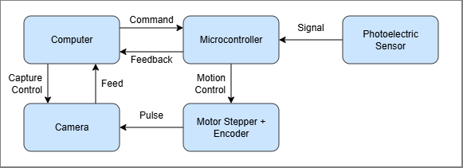
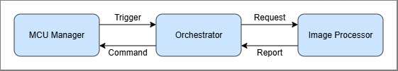

# AI-Powered Automated Optical Inspection (AOI) System

> Real-time PCB defect detection system built for NVIDIA Jetson Orin NX
> using a Basler line scan camera and YOLO26m object detection

---


## Overview

This project implements an industrial-grade AOI system that inspects
PCBs moving along a conveyor belt in real time. A line scan camera
captures the board line by line, synchronized with the conveyor
encoder. The assembled image is then processed by a YOLO26m model to
detect manufacturing defects such as missing components, mouse bites,
solder bridges, and more.

The system is architecturally designed for deployment on NVIDIA Jetson
Orin NX with a Basler line scan camera, and is currently under active
development on WSL using Pylon SDK software emulation.

### Key Features

- **Line scan acquisition** — Basler Pylon 8.x SDK with encoder-triggered
  capture, ensuring geometrically accurate images regardless of belt speed
- **Concurrent pipeline** — frame grabbing, assembly, and inference run
  on separate threads with no idle time between stages
- **YOLO26m inference** — NMS-free object detection exported to TensorRT
  for GPU-accelerated inference on Jetson Orin NX
- **MCU integration** — serial communication with microcontroller for
  board detection signals and pass/fail actuation
- **Clean architecture** — C# orchestrator, C++ image processor,
  Python training — each with a single clear responsibility

---

## System Architecture

### Hardware



The **Photoelectric Sensor** detects an incoming board and signals the
**Microcontroller**, which coordinates the hardware layer — commanding
the **Motor Stepper + Encoder** to drive the conveyor while exchanging
status and feedback with the **Computer**. The encoder generates one
pulse per unit of belt travel, directly triggering the **Camera** to
capture one pixel-row per pulse. Captured lines stream to the Computer
in real time where the full inspection pipeline runs.

### Software



---

## Tech Stack

| Layer | Technology | Reason |
|---|---|---|
| Orchestrator | C# .NET 10 | Async pipeline control, clean DI pattern |
| Image Processor | C++ 20 | Performance-critical, direct memory control |
| Camera SDK | Basler Pylon 8.x | Industry standard for machine vision |
| ML Inference | YOLO26m + TensorRT | NMS-free, GPU-optimized for edge deployment |
| ML Training | Python, Ultralytics | Fine-tuned on DeepPCB dataset |
| MCU Communication | Serial (C#) | Board trigger + pass/fail control |
| Development Env | WSL, Ubuntu 24.04 | Matches target Jetson OS (Ubuntu Noble) |
| Target Hardware | NVIDIA Jetson Orin NX | 100 TOPS, 16GB unified memory (planned) |

---

## Repository Structure

```
AoiSystem/
├── docs/
│   └── images/
│       ├── aoi-system-architecture.png   # Hardware block diagram
│       └── aoi-software-architecture.png # Software component diagram
│
├── src/
│   ├── AoiSystem.ImageProcessor/         # C++ shared library (.so)
│   │   ├── libs/
│   │   │   └── libimage_processor.so     # Compiled output
│   │   ├── models/
│   │   │   └── pcb_inspection_model.engine # TensorRT engine (Jetson)
│   │   ├── src/
│   │   │   ├── ai/
│   │   │   │   ├── InferenceModule.cpp   # YOLO26m TensorRT inference
│   │   │   │   └── InferenceModule.hpp
│   │   │   ├── camera/
│   │   │   │   ├── CameraModule.cpp      # Basler Pylon 8.x line scan
│   │   │   │   └── CameraModule.hpp
│   │   │   ├── process/
│   │   │   │   └── preprocess.cu         # CUDA image preprocessing
│   │   │   └── ImageProcessor.cpp        # Pipeline entry point + C API
│   │   └── CMakeLists.txt
│   │
│   └── AoiSystem.Orchestrator/           # C# CLI orchestrator
│       ├── Interop/
│       │   ├── IImageProcessorInterop.cs # P/Invoke interface
│       │   └── ImageProcessorInterop.cs  # Calls libimage_processor.so
│       ├── Services/
│       │   ├── IPipelineService.cs       # Inspection pipeline interface
│       │   ├── PipelineService.cs        # Manages inspection lifecycle
│       │   ├── IMcuManagerService.cs     # MCU communication interface
│       │   └── McuManagerService.cs      # Serial port MCU control
│       ├── Workers/
│       │   └── Worker.cs                 # BackgroundService main loop
│       ├── AoiSystem.Orchestrator.csproj
│       └── Program.cs                    # DI wiring + host builder
│
└── README.md
```